# Space Leak in Gundeck

There is a space leak somewhere in Gundeck; when Redis is unavailable, memory
consumption slowly climbs and is never released. It's unclear if this memory
usage is leaked resources from trying to connect to Redis, from queued
messages that never end up in Redis, or from something else. This is all
documented in https://wearezeta.atlassian.net/browse/SQPIT-1447

Part of this issue is definitely caused by queued messages in gundeck.

## Misc

Note, juspay suggests they have implemented the following in a fork:
https://github.com/juspay/hedis which might be relevant to our issues.


## Notes from Reading the Current Implementation

The current implementation of Redis reconnection in gundeck is for each redis
command issued to first check if its connection is up, and then send the
command. If the connection is down, the thread will block, waiting to reconnect.
This reconnection is driven by an MVar attached to the connection pool which
contains the current connection and logic to refresh the connection if it ever
goes down. The logic is guarded by `once . retry`, which synthesizes an `IO`
action whose goal is to force the reconnection logic to be non-reentrant.

`once` is implemented here https://hackage.haskell.org/package/extra-1.7.12/docs/src/Control.Concurrent.Extra.html#once as

```haskell
once :: IO a -> IO (IO a)
once act = do
  var <- newVar OncePending
  let run = either throwIO pure
  pure $ mask $ \unmask -> join $ modifyVar var $ \v -> case v of
      OnceDone x -> pure (v, unmask $ run x)
      OnceRunning x -> pure (v, unmask $ run =<< waitBarrier x)
      OncePending -> do
          b <- newBarrier
          pure $ (OnceRunning b,) $ do
              res <- try_ $ unmask act
              signalBarrier b res
              modifyVar_ var $ \_ -> pure $ OnceDone res
              run res
```

It's unclear if this successfully prevents re-entrancy; a casual reading through
this suggests it blocks until `OnceDone` completes, but the `join` semantics
here are non-trivial to mentally trace.

> DEBUGGING AVENUE: write a test to verify that `once` is non-reentrant.

Assuming `once` works as expected, the threads waiting on redis will all unblock
when it becomes available again. However, a close reading of `reconnectRedis`
(which is running for every blocked thread):

```haskell
reconnectRedis robustConnection = do
  conn <- connectLowLevel
  reconnectOnce <- once . retry $ do
    disconnect conn  -- THIS LINE IS ADDED BY ME
    reconnectRedis robustConnection
  let newReConnection = ReConnection {_rrConnection = conn, _rrReconnect = reconnectOnce}
  unlessM (tryPutMVar robustConnection newReConnection) $
    void $
      swapMVar robustConnection newReConnection
```

shows that *each* thread will attempt to fill the `MVar` with the result of the
reconnection; *not the thread that was responsible for conducting the
reconnection.* This is clearly a bug.

A better system here would to be to use the `MVar` in a more traditional manner:
simply empty it as soon as the broken connection is noticed. Any subsequent
commands will block on reading the Redis connection, and not enter into a race
to refresh the connection.

However, it's unclear why this would lead to a memory leak , unless perhaps
those blocked threads never resume.

> DEBUGGING AVENUE: empty the connection `MVar` as soon as it is discovered to
> be broken.


## Investigating the Space Leak

This is a good opportunity to use ghc-debug to inspect the space leak directly.
We can instrument wire-server by adding the following stanza to
`cabal.project.local`:

```yaml
package *
  ghc-options: -finfo-table-map -fdistinct-constructor-tables
```

and then wrapping `Gundeck.Main` in `withGhcDebug`. The resulting binary is
something we can pause and inspect its heap in realtime. But how can we
reproduce the problem locally?

The following will setup an environment and then disconnect Redis, which should
leave us in a broken state and exhibit the memory leak.

- `./deploy/dockerephemeral/run.sh &`
- `make db-migrate`
- `./services/start-services-only.sh &`
- `docker-compose -f deploy/dockerephemeral/docker-compose.yaml stop redis redis-node-{1,2,3,4,5,6} redis-cluster`

After running this, gundeck stays at a consistent 48k resident memory and 24k
shared memory on my machine. No memory is currently leaking, suggesting it might
be caused by receiving traffic while Redis is down.

- `cd services/gundeck`
- `for F in $(seq 1 100); do; timeout 0.1 ../../dist/gundeck-integration -s gundeck.integration.yaml -i ../integration.yaml; done`

will hit the service with 100 requests in rapid succession. This moves the
memory consumption up to 390M resident and 24k shared. Maybe this is just
request threads blocked on the MVar. By restarting Redis, we can unstick those
threads and determine if the memory consumption goes back down.

- `docker-compose -f deploy/dockerephemeral/docker-compose.yaml start redis redis-node-{1,2,3,4,5,6} redis-cluster`

Interestingly, this pushes the resident memory up to 444M, from which it doesn't
recover. Let's do the same thing again --- restarting Redis to see if it changes
the memory consumption.

- `docker-compose -f deploy/dockerephemeral/docker-compose.yaml stop redis redis-node-{1,2,3,4,5,6} redis-cluster`

No change; still at 444M. So let's hit it with another 100 requests:

- `for F in $(seq 1 100); do; timeout 0.1 ../../dist/gundeck-integration -s gundeck.integration.yaml -i ../integration.yaml; done`

Resident memory consumption is up to 446M, much less than I'd expect given the
previous hundred. This is on the order of 20K per request. What happens when we
restart Redis?

- `docker-compose -f deploy/dockerephemeral/docker-compose.yaml start redis redis-node-{1,2,3,4,5,6} redis-cluster`

Up to 450M resident memory. But, interestingly, the logs now show:

```
[gundeck@A] E, request=N/A, Redis connection failed, error=Network.Socket.socket: resource exhausted (Too many open files)
```

Have we leaked all of our sockets, and have inconsequential additional memory
burden now because our codepath fails too soon to leak anything else?

lsof says no:

```
# lsof -c gundeck  | wc -l
36
```

This seems very strange; 36 seems to be too low for the error message. How many
of these are sockets?

```
# sudo lsof -c gundeck | grep 'TCP\|UDP' | wc -l
3
```

Very strange indeed. Perhaps it's time to fire up ghc-debug.

- `ghc-debug-brick`

We can see how many sockets Haskell thinks there are by search for closures:

- `^C Socket`

Haskell agrees there are only 3 sockets open. Perhaps they were cleaned up
between showing up in the log, writing these notes, and connecting the debugger?
Nevertheless, we can see if the memory consumption is back down. But it remains
at 450M. So, whatever it is that we're leaking, sockets are not it.

The first thing to do is to save a snapshot of the program via `^X`, which I
will name `space-leak-1`. We can then dump a census profile via `^W`, saving it
as `/tmp/space-leak-1.prof`. The first 20 lines are:

```
WITH SPACE LEAK
key, total, count, max, avg
ARR_WORDS:1855296:1556:223408:1192.3496143958869
containers-0.6.5.1:Data.IntMap.Internal:Bin:655320:16383:40:40.0
containers-0.6.5.1:Data.IntMap.Internal:Tip:393240:16385:24:24.0
STACK:141920:16:32768:8870.0 ----
::SRT_2:138216:5759:24:24.0
FUN_STATIC:89976:7086:336:12.697713801862829
::SRT_3:61632:1926:32:32.0
ghc-prim:GHC.Types:::45240:1885:24:24.0
THUNK_STATIC:42072:5259:8:8.0
THUNK_1_0:39384:1641:24:24.0
bytestring-0.11.3.1:Data.ByteString.Internal:BS:38496:1203:32:32.0
THUNK:35792:902:136:39.68070953436807
base:GHC.Stack.Types:SrcLoc:20352:318:64:64.0
MUT_ARR_PTRS_CLEAN:18000:34:552:529.4117647058823
::SRT_4:17240:431:40:40.0
hedis-0.15.1-3mrVwuxTX1TE6k4pO0L3U2:Database.Redis.Cluster.Command:CommandInfo:11480:205:56:56.0
base:GHC.Stack.Types:PushCallStack:10496:328:32:32.0
base:GHC.ForeignPtr:PlainPtr:10160:635:16:16.0
PAP:9952:251:56:39.64940239043825
FUN:7136:167:96:42.73053892215569
```

It will be informative to compare this against a census profile before the leak
has occurred. So let's boot up a fresh copy of gundeck by killing our current
one, and then:


- `./deploy/dockerephemeral/run.sh &`
- `make db-migrate`
- `./services/start-services-only.sh &`

Gundeck's memory is back down to 48K. Let's attach the debugger again, and save
a new profile `^X space-leak-0`, and a new census `^W /tmp/space-leak-0.prof`:

```
NO SPACE LEAK
key, total, count, max, avg
ARR_WORDS:1849520:1291:223408:1432.6258714175058
containers-0.6.5.1:Data.IntMap.Internal:Bin:655320:16383:40:40.0
containers-0.6.5.1:Data.IntMap.Internal:Tip:393240:16385:24:24.0
::SRT_2:139872:5828:24:24.0
FUN_STATIC:90320:7114:336:12.696092212538657
STACK:80000:18:32768:4444.444444444444
::SRT_3:63200:1975:32:32.0
THUNK_STATIC:43192:5399:8:8.0
ghc-prim:GHC.Types:::41928:1747:24:24.0
THUNK_1_0:39528:1647:24:24.0
bytestring-0.11.3.1:Data.ByteString.Internal:BS:38144:1192:32:32.0
THUNK:36080:905:136:39.86740331491713
base:GHC.Stack.Types:SrcLoc:20352:318:64:64.0
::SRT_4:17440:436:40:40.0
hedis-0.15.1-3mrVwuxTX1TE6k4pO0L3U2:Database.Redis.Cluster.Command:CommandInfo:11480:205:56:56.0
base:GHC.Stack.Types:PushCallStack:10496:328:32:32.0
containers-0.6.5.1:Data.Set.Internal:Bin:10160:254:40:40.0
TVAR:9184:287:32:32.0
FUN:6632:148:96:44.810810810810814
base:GHC.ForeignPtr:PlainPtr:6000:375:16:16.0
```

This is hard to look at, so let's do a word diff:

- `git diff --no-index --patience --word-diff --word-diff-regex="[^:]+" /tmp/space-leak-0.prof /tmp/space-leak-1.prof | head -n 50`

which describes how the diff changes:

```
--- a/tmp/space-leak-0.prof
+++ b/tmp/space-leak-1.prof
@@ -1,110 +1,109 @@
key, total, count, max, avg
ARR_WORDS:[-1849520:1291-]{+1855296:1556+}:223408:[-1432.6258714175058-]{+1192.3496143958869+}
containers-0.6.5.1:Data.IntMap.Internal:Bin:655320:16383:40:40.0
containers-0.6.5.1:Data.IntMap.Internal:Tip:393240:16385:24:24.0
{+STACK:141920:16:32768:8870.0+}
::SRT_2:[-139872:5828-]{+138216:5759+}:24:24.0
FUN_STATIC:[-90320:7114-]{+89976:7086+}:336:[-12.696092212538657-]
[-STACK:80000:18:32768:4444.444444444444-]{+12.697713801862829+}
::SRT_3:[-63200:1975-]{+61632:1926+}:32:32.0[-THUNK_STATIC:43192:5399:8:8.0-]
ghc-prim:GHC.Types:::[-41928:1747-]{+45240:1885+}:24:24.0
{+THUNK_STATIC:42072:5259:8:8.0+}
THUNK_1_0:[-39528:1647-]{+39384:1641+}:24:24.0
bytestring-0.11.3.1:Data.ByteString.Internal:BS:[-38144:1192-]{+38496:1203+}:32:32.0
THUNK:[-36080:905-]{+35792:902+}:136:[-39.86740331491713-]{+39.68070953436807+}
base:GHC.Stack.Types:SrcLoc:20352:318:64:64.0
{+MUT_ARR_PTRS_CLEAN:18000:34:552:529.4117647058823+}
::SRT_4:[-17440:436-]{+17240:431+}:40:40.0
hedis-0.15.1-3mrVwuxTX1TE6k4pO0L3U2:Database.Redis.Cluster.Command:CommandInfo:11480:205:56:56.0
base:GHC.Stack.Types:PushCallStack:10496:328:32:32.0
[-containers-0.6.5.1:Data.Set.Internal:Bin:10160:254:40:40.0-]
[-TVAR:9184:287:32:32.0-]
[-FUN:6632:148:96:44.810810810810814-]base:GHC.ForeignPtr:PlainPtr:[-6000:375-]{+10160:635:16:16.0+}
{+PAP:9952:251:56:39.64940239043825+}
{+FUN:7136:167:96:42.73053892215569+}
{+FUN_1_0:5952:372:16:16.0+}
{+IND_STATIC:5888:368+}:16:16.0
ghc-prim:GHC.Tuple:(,):[-5784:241-]{+5568:232+}:24:24.0
ghc-prim:GHC.Types:I#:[-5536:346-]{+5568:348+}:16:16.0
[-FUN_1_0:5408:338:16:16.0-]
[-MUT_ARR_PTRS_FROZEN_CLEAN:5392:9:2624:599.1111111111111-]{+containers-0.6.5.1:Data.Set.Internal:Bin:5240:131:40:40.0+}
{+TVAR:5120:160:32:32.0+}
::SRT_5:5088:106:48:48.0
::SRT_6:4480:80:56:56.0
[-base:GHC.Conc.Sync:TVar:4224:264:16:16.0-]{+MUT_ARR_PTRS_FROZEN_CLEAN:4336:8:2624:542.0+}
::SRT_16:4216:31:136:136.0
[-PAP:4168:107:56:38.953271028037385-]
[-IND_STATIC:4080:255:16:16.0-]THUNK_0_1:[-4008:167-]{+4032:168+}:24:24.0
base:GHC.Exception.Type:C:Exception:3696:77:48:48.0
[-MUT_ARR_PTRS_CLEAN:3568:33:552:108.12121212121212-]base:GHC.Show:C:Show:[-3424:107-]{+3456:108+}:32:32.0
{+containers-0.6.5.1:Data.Map.Internal:Bin:3120:65:48:48.0+}
{+FUN_2_0:2976:124:24:24.0+}
::SRT_7:2752:43:64:64.0
base:GHC.Maybe:Just:[-2720:170-]{+2704:169+}:16:16.0
tls-1.5.8-AnXiukLmENq4EmjwCC761P:Network.TLS.Cipher:Cipher:2368:37:64:64.0
[-FUN_2_0:2352:98:24:24.0-
```

There is no obvious smoking gun here; except for maybe that new `STACK`. Dang.
Let's switch back to the `space-leak-1` profile and search around with random
data constructors present in `Gundeck.Redis` to see if we can accidentally
stumble upon lots of them:

- `ReConnection: 1`
- `Connection: 2`
- `Handler: 8`
- `C:Show: 108`
- `C:MonadUnliftIO: 7`
- `C:MonadLogger: 4`
- `ConnectionLostException: 0`
- `IOException: 0`
- `C:Exception: 77`
- `MVar: 39`
- `BS: >500`
- `Bin: >500`
- `Tip: >500`

None of this is obviously the problem, unfortunately. Let's instead get a
level-2 census (which contains type information, not just data constructors) for
each of our profiles. This isn't in `ghc-debug-brick` by default, so we'll have
to patch it in.

```diff
--- a/ghc-debug-brick/src/Lib.hs
+++ b/ghc-debug-brick/src/Lib.hs
@@ -226,7 +226,7 @@ profile :: Debuggee -> FilePath -> IO ()
 profile dbg fp = do
   c <- run dbg $ do
     roots <- GD.gcRoots
-    GD.censusClosureType roots
+    GD.census2LevelClosureType roots
   GD.writeCensusByClosureType fp c
```

Let's dump out `space-leak-0`'s level-2 census by reloading it, and then `^W
/tmp/space-leak-0.prof2`. But this crashes when we attempt it, because there is
a cache miss; apparently the profile didn't save everything necessary.
Thankfully I still have the program running, so we can just dump the census from
the running program instead of from the profile. The first 20 lines:

```
NO SPACE LEAK / CENSUS 2
key, total, count, max, avg
ARR_WORDS[]:1848248:1280:223408:1443.94375
containers-0.6.5.1:Data.IntMap.Internal:Tip[hedis-0.15.1-3mrVwuxTX1TE6k4pO0L3U2:Database.Redis.Cluster:Shard]:393216:16384:24:24.0
containers-0.6.5.1:Data.IntMap.Internal:Bin[containers-0.6.5.1:Data.IntMap.Internal:Tip,containers-0.6.5.1:Data.IntMap.Internal:Tip]:327680:8192:40:40.0
containers-0.6.5.1:Data.IntMap.Internal:Bin[containers-0.6.5.1:Data.IntMap.Internal:Bin,containers-0.6.5.1:Data.IntMap.Internal:Bin]:327640:8191:40:40.0
bytestring-0.11.3.1:Data.ByteString.Internal:BS[base:GHC.ForeignPtr:PlainPtr]:33696:1053:32:32.0
STACK[MVAR_CLEAN,FUN,FUN,THUNK_2_0,FUN_1_0,MUT_VAR_DIRTY,FUN_STATIC,TVAR]:32768:1:32768:32768.0
STACK[MVAR_CLEAN,FUN,FUN_2_0,THUNK_STATIC,FUN,FUN_1_0,MUT_VAR_CLEAN,ARR_WORDS,network-3.1.2.7-AmVVGD5XBbk5vvu9NIEZsO:Network.Socket.Types:C:SocketAddress,MUT_VAR_CLEAN,ARR_WORDS,FUN_1_0,FUN,warp-3.3.23-COyJh9IHH0hJj4gp7MicWX:Network.Wai.Handler.Warp.Settings:Settings,FUN_STATIC,FUN_1_0,PAP,base:GHC.Conc.Sync:TVar,warp-3.3.23-COyJh9IHH0hJj4gp7MicWX:Network.Wai.Handler.Warp.Types:InternalInfo,FUN,TVAR,base:GHC.Maybe:Just,FUN_STATIC,FUN_STATIC,FUN_STATIC,auto-update-0.1.6-CmZHk3Df5nW5lZAcIP2QF6:Control.Reaper:Reaper,FUN_STATIC,FUN_STATIC,FUN_STATIC,network-3.1.2.7-AmVVGD5XBbk5vvu9NIEZsO:Network.Socket.Types:Socket,FUN_1_0,THUNK,FUN_1_0,FUN_2_0,FUN_STATIC]:32768:1:32768:32768.0
THUNK[::SRT_2,ARR_WORDS]:32760:819:40:40.0
::SRT_2[FUN_STATIC,::SRT_2]:24960:1040:24:24.0
::SRT_2[FUN_STATIC,FUN_STATIC]:23976:999:24:24.0
THUNK_STATIC[]:20792:2599:8:8.0
base:GHC.Stack.Types:SrcLoc[THUNK_STATIC,THUNK_STATIC,THUNK_STATIC,ghc-prim:GHC.Types:I#,ghc-prim:GHC.Types:I#,ghc-prim:GHC.Types:I#,ghc-prim:GHC.Types:I#]:20352:318:64:64.0
::SRT_2[FUN_STATIC,THUNK_STATIC]:18336:764:24:24.0
FUN_STATIC[FUN_STATIC]:17280:2160:8:8.0
ghc-prim:GHC.Types::[THUNK_1_0,ghc-prim:GHC.Types::]:13608:567:24:24.0
FUN_STATIC[]:11888:1486:8:8.0
THUNK_1_0[bytestring-0.11.3.1:Data.ByteString.Internal:BS]:11544:481:24:24.0
::SRT_2[THUNK_STATIC,::SRT_2]:11448:477:24:24.0
hedis-0.15.1-3mrVwuxTX1TE6k4pO0L3U2:Database.Redis.Cluster.Command:CommandInfo[bytestring-0.11.3.1:Data.ByteString.Internal:BS,THUNK_1_0,ghc-prim:GHC.Types::,THUNK,THUNK_1_0,THUNK]:11424:204:56:56.0
THUNK_STATIC[FUN_STATIC]:10016:1252:8:8.0
```

Interestingly, this says there are `16384` leafs of an IntMap that contain hedis
`Shard`s. But this is before the memory leak happens, so it's not our culprit.
As a quick sanity check, gundeck is still running at 48K of resident memory.

Attempting to generate the census-2 for `space-leak-1` results in the same cache
miss, so we'll have to reset our environment again, which is frustrating because
it might invalidate any reasoning we've done about the heap.

Since the running program is still in a pristine state, we can just turn off
redis and hit it with some requests.

- `docker-compose -f deploy/dockerephemeral/docker-compose.yaml stop redis redis-node-{1,2,3,4,5,6} redis-cluster`
- `cd services/gundeck`
- `for F in $(seq 1 100); do; timeout 0.1 ../../dist/gundeck-integration -s gundeck.integration.yaml -i ../integration.yaml; done`

Our resident memory is back up to 333M, slightly less than the 390M from last
time around. Restarting redis brings the consumption up to 352M. Stopping redis
again and hitting it with another 100 requests . Now 388M resident usage. For
good measure, let's make a profile and a census2 while we've got the requests
blocked. `^X space-leak-held`; `^X /tmp/space-leak-held.prof2`.

I'll now restart redis. Memory consumption is up to 491M. Make a new profile and
census2: `^X space-leak-released`; `^X /tmp/space-leak-released.prof2`. Since we
are most interested in the memory that has leaked w.r.t the initial state, let's
compare the new census2 for `space-leak-released`:

```
RELEASED SPACE LEAK / CENSUS2
key, total, count, max, avg
ARR_WORDS[]:1849432:1291:223408:1432.557707203718
containers-0.6.5.1:Data.IntMap.Internal:Tip[hedis-0.15.1-3mrVwuxTX1TE6k4pO0L3U2:Database.Redis.Cluster:Shard]:393216:16384:24:24.0
containers-0.6.5.1:Data.IntMap.Internal:Bin[containers-0.6.5.1:Data.IntMap.Internal:Tip,containers-0.6.5.1:Data.IntMap.Internal:Tip]:327680:8192:40:40.0
containers-0.6.5.1:Data.IntMap.Internal:Bin[containers-0.6.5.1:Data.IntMap.Internal:Bin,containers-0.6.5.1:Data.IntMap.Internal:Bin]:327640:8191:40:40.0
bytestring-0.11.3.1:Data.ByteString.Internal:BS[base:GHC.ForeignPtr:PlainPtr]:34112:1066:32:32.0
STACK[MVAR_CLEAN,FUN,FUN,THUNK_2_0,FUN_1_0,MUT_VAR_DIRTY,FUN_STATIC,TVAR]:32768:1:32768:32768.0
STACK[MVAR_CLEAN,FUN,FUN_2_0,THUNK_STATIC,FUN,FUN_1_0,MUT_VAR_CLEAN,ARR_WORDS,network-3.1.2.7-AmVVGD5XBbk5vvu9NIEZsO:Network.Socket.Types:C:SocketAddress,MUT_VAR_CLEAN,ARR_WORDS,FUN_1_0,FUN,warp-3.3.23-COyJh9IHH0hJj4gp7MicWX:Network.Wai.Handler.Warp.Settings:Settings,FUN_STATIC,FUN_1_0,PAP,base:GHC.Conc.Sync:TVar,warp-3.3.23-COyJh9IHH0hJj4gp7MicWX:Network.Wai.Handler.Warp.Types:InternalInfo,FUN,TVAR,base:GHC.Maybe:Just,FUN_STATIC,FUN_STATIC,FUN_STATIC,auto-update-0.1.6-CmZHk3Df5nW5lZAcIP2QF6:Control.Reaper:Reaper,FUN_STATIC,FUN_STATIC,FUN_STATIC,network-3.1.2.7-AmVVGD5XBbk5vvu9NIEZsO:Network.Socket.Types:Socket,FUN_1_0,THUNK,FUN_1_0,FUN_2_0,FUN_STATIC]:32768:1:32768:32768.0
STACK[MVAR_CLEAN,FUN,FUN_STATIC,ghc-bignum:GHC.Num.Integer:IS,MUT_ARR_PTRS_FROZEN_CLEAN,FUN,FUN_STATIC]:32768:1:32768:32768.0
STACK[base:GHC.ForeignPtr:PlainPtr,MUT_VAR_DIRTY,base:GHC.ForeignPtr:ForeignPtr,FUN_1_0,MUT_VAR_CLEAN,MUT_VAR_CLEAN,ghc-prim:GHC.Types:False,MUT_VAR_CLEAN,MVAR_CLEAN,base:GHC.Event.EPoll:EPoll,FUN_STATIC,FUN,FUN,FUN_STATIC]:32768:1:32768:32768.0
THUNK[::SRT_2,ARR_WORDS]:32320:808:40:40.0
::SRT_2[FUN_STATIC,::SRT_2]:24696:1029:24:24.0
::SRT_2[FUN_STATIC,FUN_STATIC]:23736:989:24:24.0
THUNK_STATIC[]:20632:2579:8:8.0
base:GHC.Stack.Types:SrcLoc[THUNK_STATIC,THUNK_STATIC,THUNK_STATIC,ghc-prim:GHC.Types:I#,ghc-prim:GHC.Types:I#,ghc-prim:GHC.Types:I#,ghc-prim:GHC.Types:I#]:20352:318:64:64.0
FUN_STATIC[FUN_STATIC]:17216:2152:8:8.0
::SRT_2[FUN_STATIC,THUNK_STATIC]:17136:714:24:24.0
ghc-prim:GHC.Types::[THUNK_1_0,ghc-prim:GHC.Types::]:13344:556:24:24.0
MUT_ARR_PTRS_CLEAN[base:GHC.Event.IntTable:Empty,base:GHC.Event.IntTable:Empty,base:GHC.Event.IntTable:Empty,base:GHC.Event.IntTable:Empty,base:GHC.Event.IntTable:Empty,base:GHC.Event.IntTable:Empty,base:GHC.Event.IntTable:Empty,base:GHC.Event.IntTable:Empty,base:GHC.Event.IntTable:Empty,base:GHC.Event.IntTable:Empty,base:GHC.Event.IntTable:Empty,base:GHC.Event.IntTable:Empty,base:GHC.Event.IntTable:Empty,base:GHC.Event.IntTable:Empty,base:GHC.Event.IntTable:Empty,base:GHC.Event.IntTable:Empty,base:GHC.Event.IntTable:Empty,base:GHC.Event.IntTable:Empty,base:GHC.Event.IntTable:Empty,base:GHC.Event.IntTable:Empty,base:GHC.Event.IntTable:Empty,base:GHC.Event.IntTable:Empty,base:GHC.Event.IntTable:Empty,base:GHC.Event.IntTable:Empty,base:GHC.Event.IntTable:Empty,base:GHC.Event.IntTable:Empty,base:GHC.Event.IntTable:Empty,base:GHC.Event.IntTable:Empty,base:GHC.Event.IntTable:Empty,base:GHC.Event.IntTable:Empty,base:GHC.Event.IntTable:Empty,base:GHC.Event.IntTable:Empty,base:GHC.Event.IntTable:Empty,base:GHC.Event.IntTable:Empty,base:GHC.Event.IntTable:Empty,base:GHC.Event.IntTable:Empty,base:GHC.Event.IntTable:Empty,base:GHC.Event.IntTable:Empty,base:GHC.Event.IntTable:Empty,base:GHC.Event.IntTable:Empty,base:GHC.Event.IntTable:Empty,base:GHC.Event.IntTable:Empty,base:GHC.Event.IntTable:Empty,base:GHC.Event.IntTable:Empty,base:GHC.Event.IntTable:Empty,base:GHC.Event.IntTable:Empty,base:GHC.Event.IntTable:Empty,base:GHC.Event.IntTable:Empty,base:GHC.Event.IntTable:Empty,base:GHC.Event.IntTable:Empty,base:GHC.Event.IntTable:Empty,base:GHC.Event.IntTable:Empty,base:GHC.Event.IntTable:Empty,base:GHC.Event.IntTable:Empty,base:GHC.Event.IntTable:Empty,base:GHC.Event.IntTable:Empty,base:GHC.Event.IntTable:Empty,base:GHC.Event.IntTable:Empty,base:GHC.Event.IntTable:Empty,base:GHC.Event.IntTable:Empty,base:GHC.Event.IntTable:Empty,base:GHC.Event.IntTable:Empty,base:GHC.Event.IntTable:Empty,base:GHC.Event.IntTable:Empty]:12512:23:544:544.0
FUN_STATIC[]:11832:1479:8:8.0
::SRT_2[THUNK_STATIC,::SRT_2]:11208:467:24:24.0
```

Still no smoking guns. That's OK. We'll hold onto these profiles to use retainer
information later when we track down where the memory is going.

Digging through the GC roots in ghc-debug, we find several Thread State Objects
(TSOs), 13 of which are blocked on `MVar`s, and 3 blocked on c calls. My guess
is those 3 align with trying to recv from sockets; indeed, there are 3 `Socket`
closures that exist. Are those other 13 leaked threads, and the memory we're
seeing their stacks?

Maybe the next step is to get an eventlog profile, which might show us what's
eating up our memory. Recompile the package with `profiling: true`. We now need
to turn on `+RTS -hy -l-agu`, but `start-services-only` doesn't support this, so
we need to patch it:

```
    def spawn(self, config_file, environment):
        if self.name == "gundeck":
            return subprocess.Popen([self.path(), "-c", config_file, "+RTS", "-hy", "-l-agu"],
                                encoding='utf-8',
                                cwd=os.path.join(ROOT, "services", self.name),
                                env=environment,
                                stdout=subprocess.PIPE,
                                stderr=subprocess.STDOUT)

        return subprocess.Popen([self.path(), "-c", config_file],
                               encoding='utf-8',
                               cwd=os.path.join(ROOT, "services", self.name),
                               env=environment,
                               stdout=subprocess.PIPE,
                               stderr=subprocess.STDOUT)
```

In addition, we can add some `traceMarkerIO` calls to the code to determine when
reconnection is wanted, when disconnection occurs, and when the connection comes
back. We will now run the same test: turn off redis, hit the server with 100
requests, renable redis, turn it off again, hit it with 100 more, and then start
redis again.

This time, gundeck uses 519M resident memory after the first 100 requests, up to
529M when redis is restarted. After our second push and restart, it gets up to
781M.

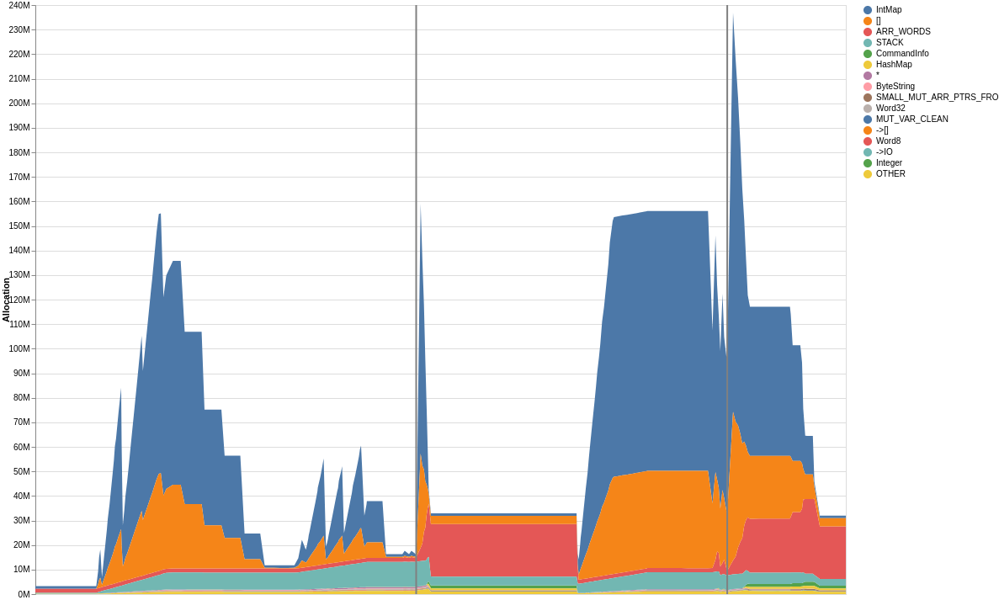

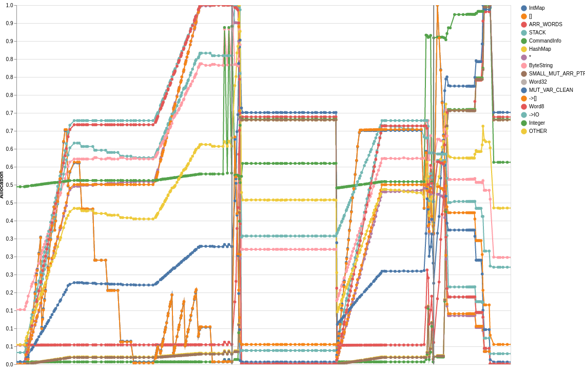

The grey vertical lines correspond to successful reconnections, at which point
we see a spiking flurry of allocation of `IntMap`s (blue) and lists (orange).
Also, we see a big flood of newly allocated `ARR_WORDS` (red) immediately after
this spike. It's not entirely clear what is driving the other allocations on
this chart, so we'll try again with some more trace points. It would be nice to
know when requests come in, when we first lose our connection, and when we begin
shutting down.

Digging in to which requests I should track, I realize the API call my
integration tests have been running does not actually hit the `push` call, which
presumably is the actual possibility for loss-of-data. Instead, we will use the
`Push many to Cannon via bulkpush (via gundeck; group notif)` test, which seems
more likely to exhibit the space-leaking we hope to see:

```diff
--- a/services/gundeck/test/integration/API.hs
+++ b/services/gundeck/test/integration/API.hs
@@ -76,12 +76,13 @@ tests s =
     "API tests"
     [ testGroup
         "Push"
-        [ test s "Register a user" addUser,
-          test s "Delete a user" removeUser,
-          test s "Replace presence" replacePresence,
-          test s "Remove stale presence" removeStalePresence,
-          test s "Single user push" singleUserPush,
-          test s "Single user push with large message" singleUserPushLargeMessage,
+        [
@@ -1021,7 +1022,7 @@ connectUsersAndDevicesWithSendingClients ca uidsAndConnIds = do
           chwrite <- liftIO $ atomically newTChan
           _ <- wsRun ca uid conn (wsReaderWriter chread chwrite)
           pure (chread, chwrite)
-    assertPresences (uid, conns)
+    -- assertPresences (uid, conns)
     pure chs

 -- similar to the function above, but hooks
@@ -1041,7 +1042,7 @@ connectUsersAndDevicesWithSendingClientsRaw ca uidsAndConnIds = do
           chwrite <- liftIO $ atomically newTChan
           _ <- wsRun ca uid conn (wsReaderWriterPing chread chwrite)
           pure (chread, chwrite)
-    assertPresences (uid, conns)
+    -- assertPresences (uid, conns)
```

The request we'd now like to track is `i/push/v2`. So let's add that, as well as
a trace when we begin shutting down. Additionally, trying to add a first
disconnect message indicated I had added my call to `disconnect` *inside* the
retry, which is probably wrong. Instead, do this:

```diff
--- a/services/gundeck/src/Gundeck/Redis.hs
+++ b/services/gundeck/src/Gundeck/Redis.hs
@@ -91,7 +92,12 @@ connectRobust l retryStrategy connectLowLevel = do
       conn <- connectLowLevel
       Log.info l $ Log.msg (Log.val "successfully connected to Redis")

-      reconnectOnce <- once . retry $ reconnectRedis robustConnection
+      reconnectOnce <- once $ do
+        traceMarkerIO "disconnect"
+        disconnect conn
+        retry $ do
+          reconnectRedis robustConnection
+            <* traceMarkerIO "reconnected"
```

Let's boot up the whole thing again. This time, I'll wait a minute before
turning off redis, and then wait a minute before sending any requests. In
addition, I will wait for 0.5s between each request:

- `for F in $(seq 1 100); do; timeout 0.5 ../../dist/gundeck-integration -s gundeck.integration.yaml -i ../integration.yaml; done`

Now wait a minute before restarting redis. While waiting, I notice my memory
usage is now 692M from gundeck; it's unclear if this is due to the new test or
just usage of profiling options. While waiting, this error message is very
prevalent in the logs:

> [gundeck@A] E, network error when connecting to Redis, error=Network.Socket.socket: resource exhausted (Too many open files)

We'll wait another minute before stopping redis again, and then another minute
after that before hitting it with more requests. There is no increase in
resident RAM after running the second batch of requests but before starting
redis. Indeed, it stays at 694M resident memory after restarting redis. I will
kill the process in 1 minute and generate the event log.

The overall chart is very odd; our second batch of pushes don't seem to have
made it to gundeck, which would explain the constant memory usage. From the
persistence of the `Too many open files`, it's likely that we ran out of
sockets.

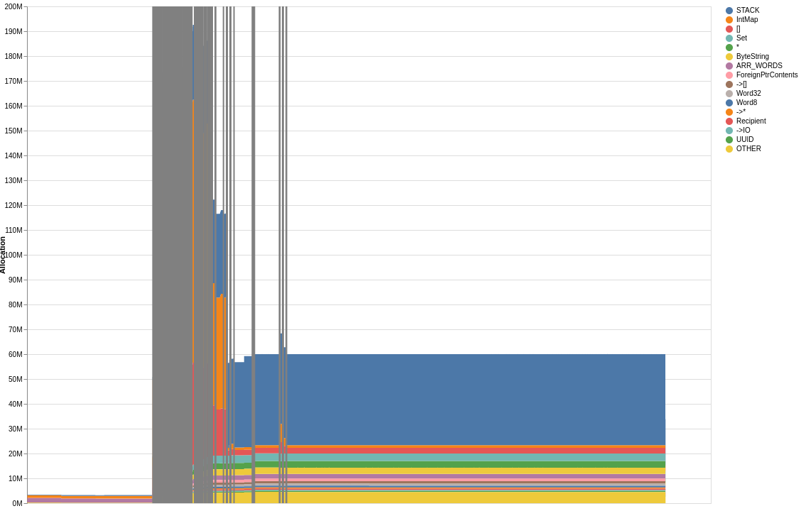

Refining to the interesting part of the chart:

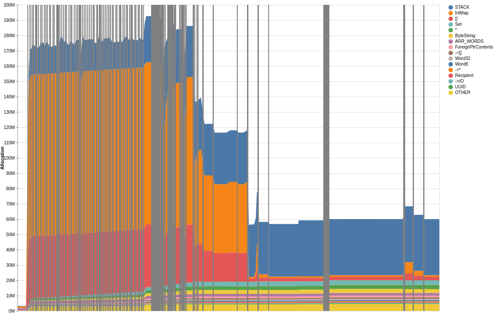

We see the regularly spaced lines on the left are pushes; but the thick bands on
the left are reconnection events --- **even though redis is still up!** A quick
reading of `Gundeck.Redis` shows why: *any* `IOException` will trigger a
reconnect, not just those that come from redis! In the steady state at the end,
our new big thick blue line is STACK objects; presumably, from blocked handler
thread.

Let's ignore the "wants reconnection" traces which are presumably drowning out
the disconnected traces. There is only one "disconnected" trace, which occurs at
110s --- much sooner than I actually disconnected redis. **This is strong
evidence that the reconnection machinery is being affected by arbitrary IO
exceptions.**

Let's try the whole analysis again, this time only making 20 requests each turn.
Perhaps that will not saturate our sockets so soon and we can get more
interesting information. ALTERNATIVELY, this change also started calling
`disconnect` less frequently, which might be the cause of the socket leak.

> DEBUGGING AVENUE: is this related to the less-frequent calling of disconnect?

After some debugging to write an automatic test script (I have been doing this
all by hand thus far!) I'm ready to go again. 20 requests is still too many. I
am going to lower the bulkpush test to run 20 users with 8 connections each, and
only do a single run of the integration test.

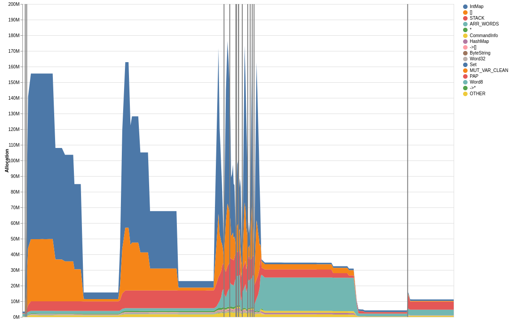

Interestingly, the second mountain on the left here does not correspond to a
push event. Instead, the second push is right at the end there.

Update. Even *that* exhausts the sockets! Let's try again, with 10 users. Also,
I've added some new traces to look at when a handler threads finishes. These
return immediately; digging in shows that the push handler starts a new thread
by way of `push > pushAll > mpaForkIO`. Let's quickly trace those to see if
anything interesting happens.

Nothing obviously interesting. Very frustrating.

Ok, we need a more specific plan here. Let's use the new testing infra I wrote
to get the following traces and compare them:

With redis up the whole time

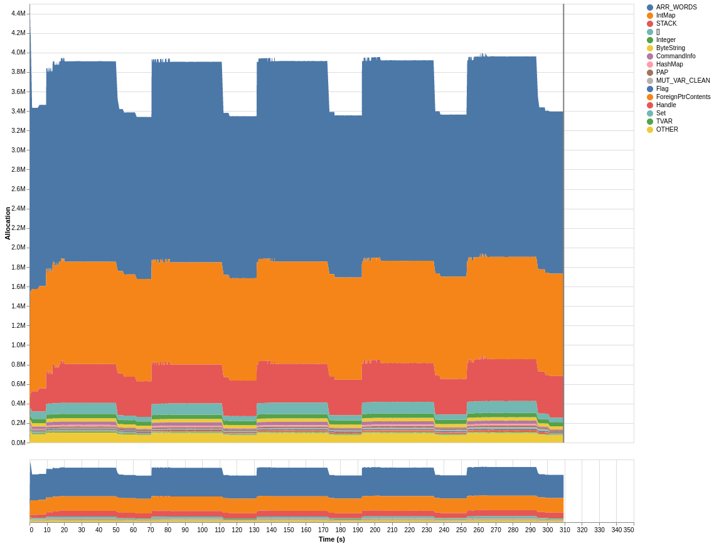

Without a call to disconnect

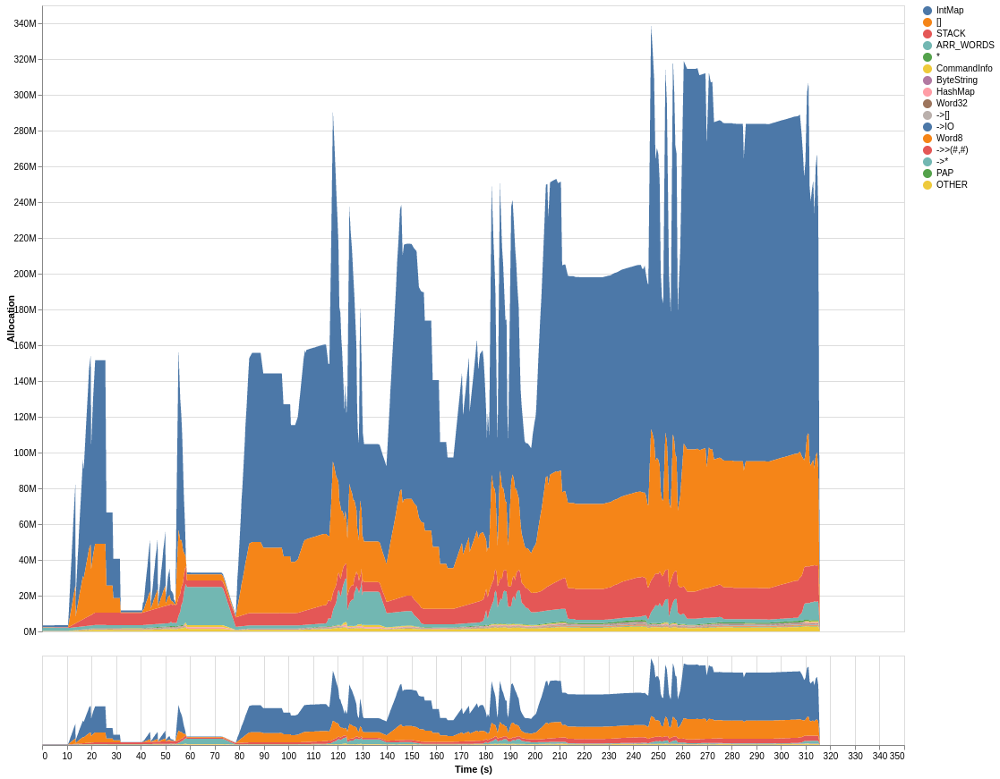


- with one call to disconnect outside of the retry

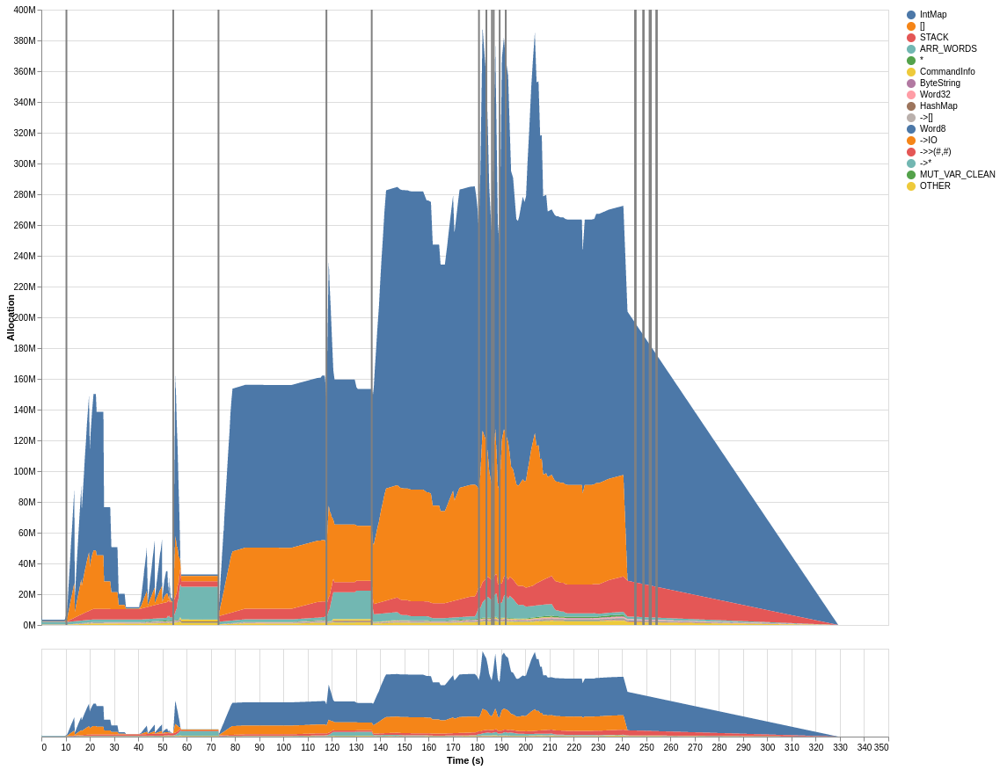

- with many calls to disconnect inside of the retry

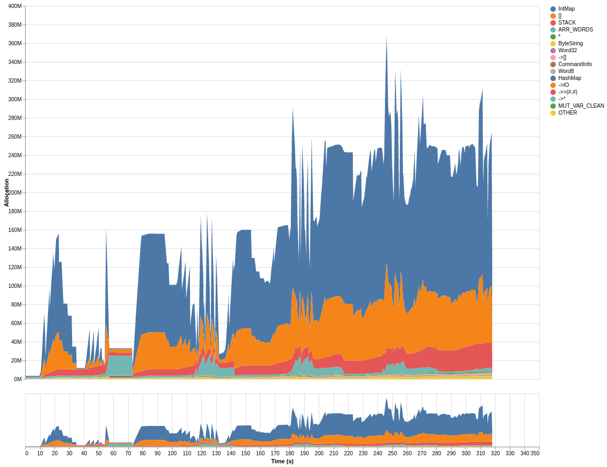


## Another Day

Attacking the problem with some fresh eyes. It seems to me that we might not
actually have a space leak, and instead are just getting into a state where
every request is blocked on the redis MVar being disconnected. This would look a
lot like a memory leak and eventually result in an OOM kill.

I've also started reading https://well-typed.com/blog/2021/03/memory-return/,
which suggests using the RTS flag `--disable-delayed-os-memory-return` will
prevent the runtime from keeping unneeded memory around, which might make the
graphs look a little more sane. I'm going to rerun the four tests wrt redis
disconnecting from yesterday with this flag and see if anything obvious happens.

In the meantime, I will go ahead and see if I can make a smaller, easier to
reproduce version of the problem by copying the reconnect logic. A night's sleep
has made me want to investigate the thread budget machinery.

I looked through the thread budget, everything seems kosher, although it might
be interesting to put some trace markers on allocations, deallocations and
warnings in it.

At this point, my working theory is that someone is leaking sockets, and
therefore, we run out of sockets, which gets interpreted as a redis
disconnection, and exacerbates the problem, likely blocking all subsequent
threads, which would keep their stacks on resident memory.

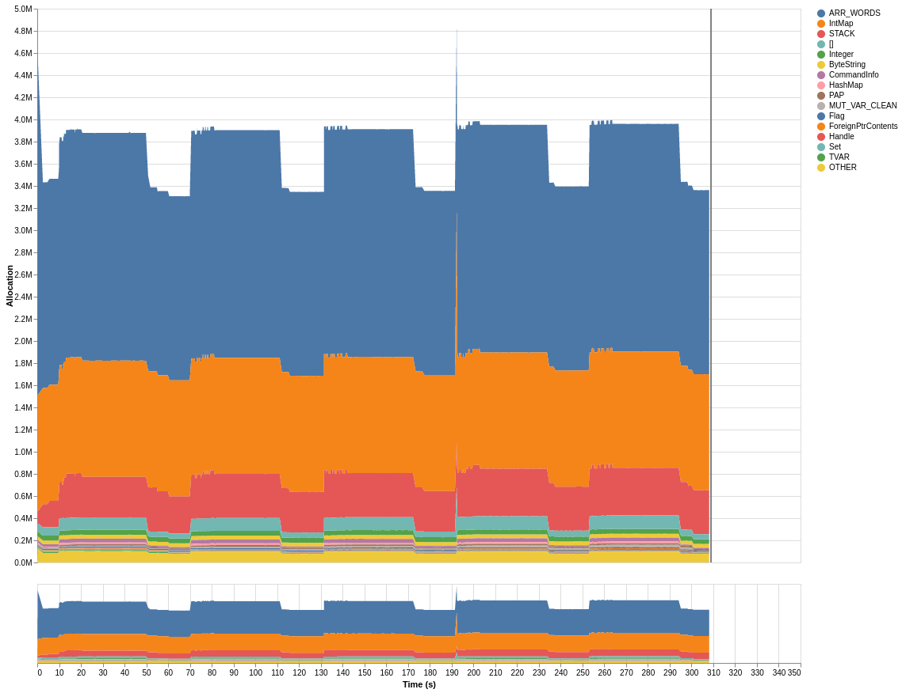

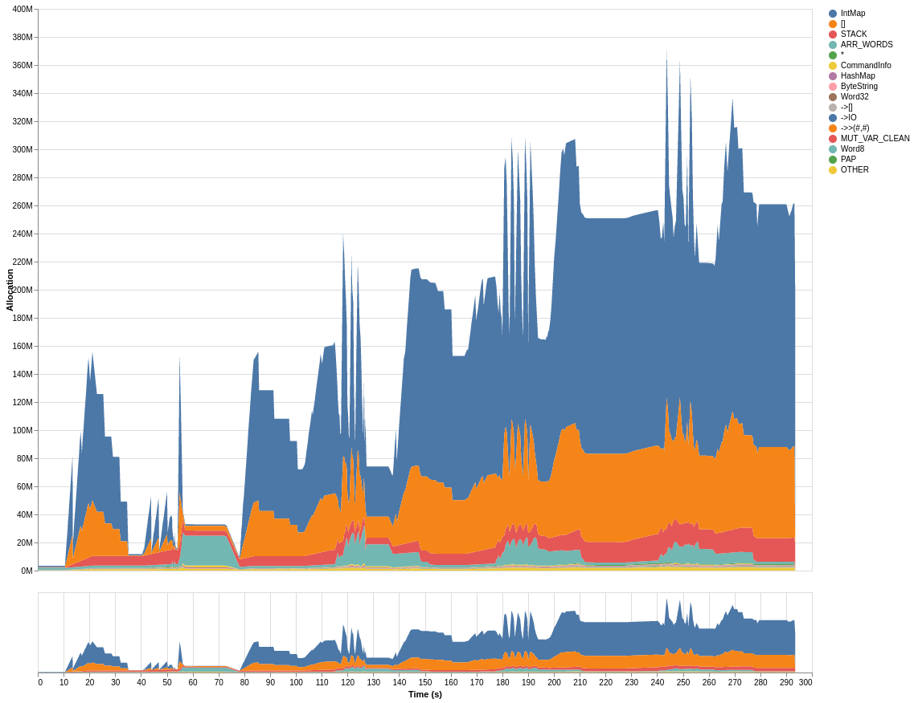

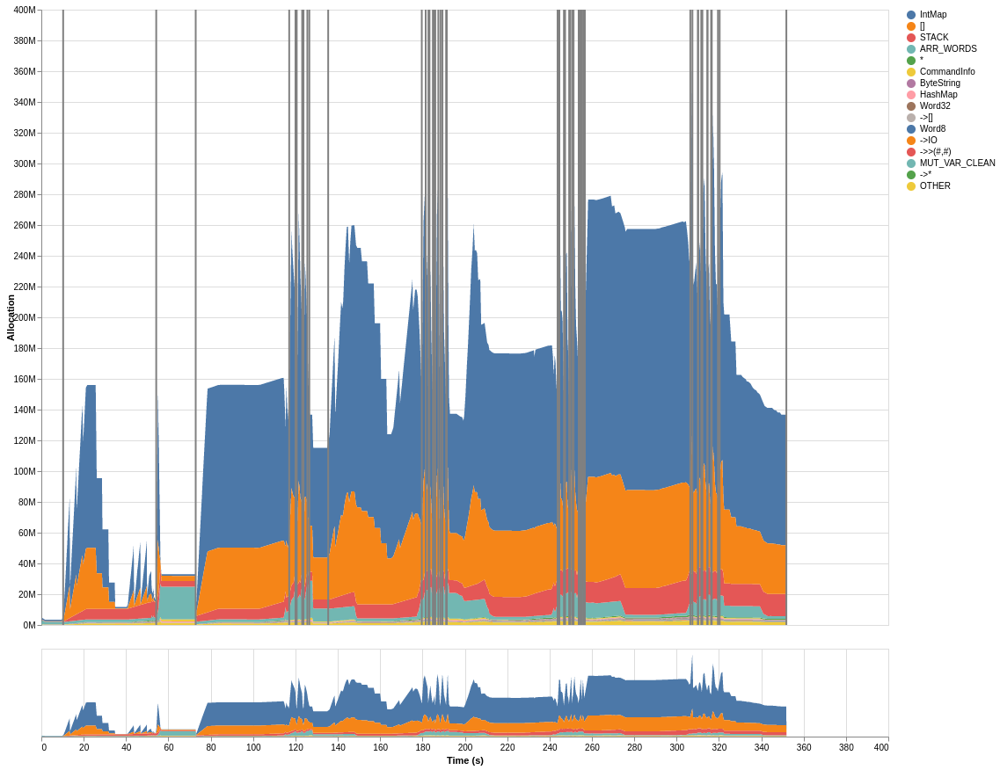

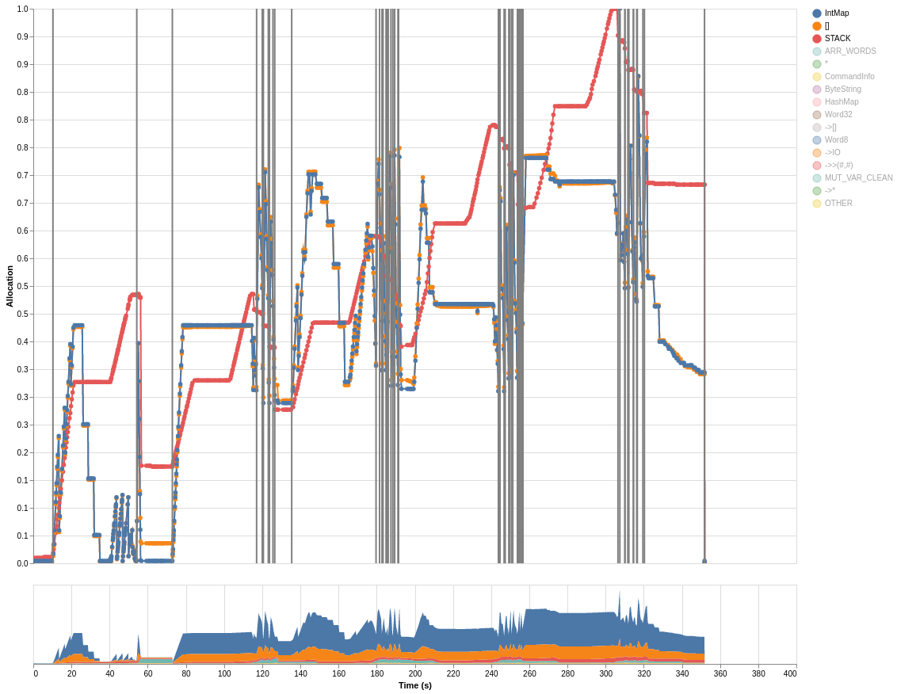

Looking at `One disconnect, no delayed dealloc, stacks`, the biggest leaking
allocations are stacks, with the intmaps and

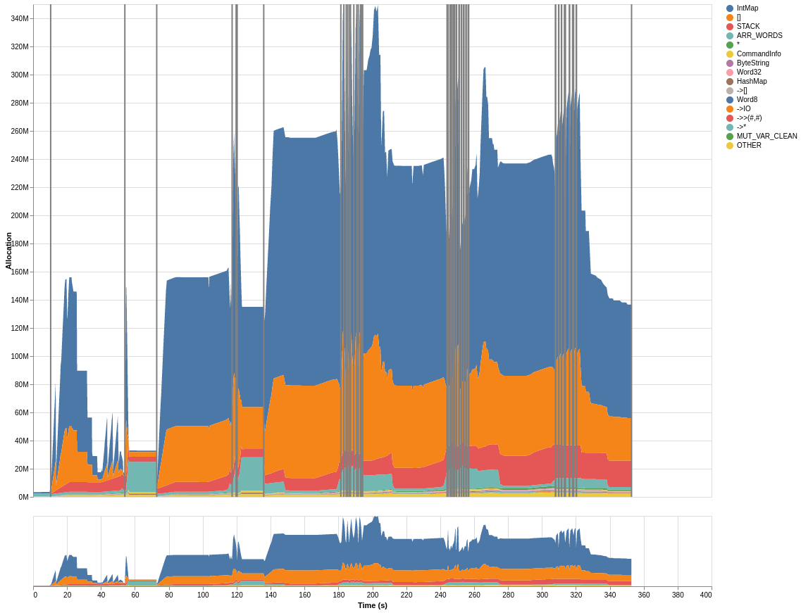

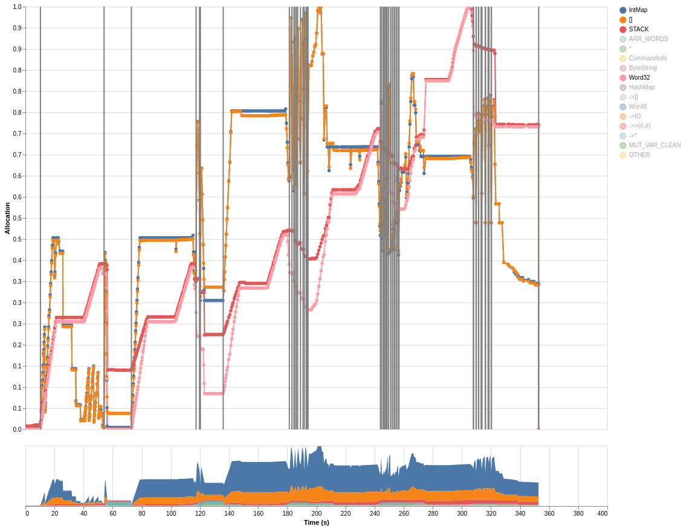

Comparing these against redis being online, we pay *a lot*  of allocation of
those IntMaps and []s. It's unclear which disconnect strategy is best --- if it
matters at all --- but let's see what's allocating all of those intmaps and
lists. We can run the same test (just with many disconnect, since it's what I
have still), but this time with the `-p` RTS flag.

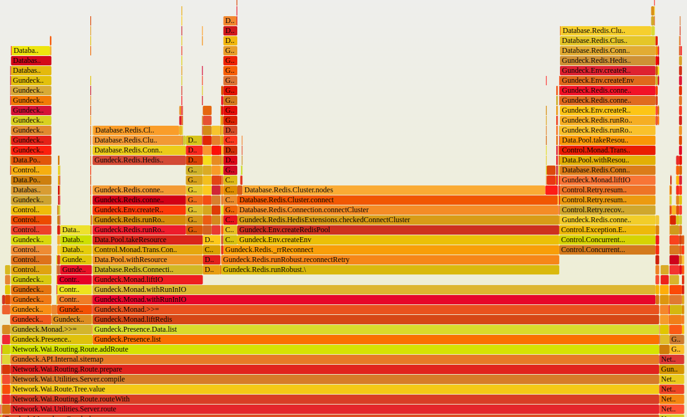

All the allocation centers here are `Database.Redis.Cluster.nodes`:

```haskell
nodes :: ShardMap -> [Node]
nodes (ShardMap shardMap) =
    concatMap snd $ IntMap.toList $ fmap shardNodes shardMap
  where
    shardNodes :: Shard -> [Node]
    shardNodes (Shard master slaves) = master:slaves
```

It's not hard to see why this would allocate hard. For every shard, it allocates
a new cons cell *inside* the `IntMap`, then calls toList on these, making a new
cons cell for each element, and then doing concatmap on the whole thing, which
is also another round of cons cells.

Worse, the only callsite for it is in `nodeConnections`, which uses the $O(n^2)$
`nub`:

```haskell
nodeConnections :: ShardMap -> IO (HM.HashMap NodeID NodeConnection)
nodeConnections shardMap
  = HM.fromList <$> mapM connectNode (nub $ nodes shardMap)
```

We can quickly dig into these shard maps by looking at an old ghc-debug profile
we have lying around. For example, `space-leak-1` shows there is one `ShardMap`
in scope, with size 8192. But there are only three `Shard`s, none of which have
any slave nodes --- the `ShardMap` just references these shards with extremely
high redundancy.

We can run a quick estimate of the work done by `nodes` here. The `fmap
shardNodes shardMap` calls `shardNodes` 8192 times, each which results in a new
cons-cell, of the form `master : []`. This is 8192 allocations, which are then
re-packed into the `IntMap`, in which we can zero sharing, and thus we need to
update every one of the 8192 nodes in the `IntMap`, which is another 8192
allocations. Hedis then calls `toList` on this, which does 8192 cons-cell
allocations, with another 8192 allocations for the tuples with the keys
(although the inliner might be smart enough to fuse these away), and then
smooshes them down with `concatMap`, which does my head in to think about, but
is probably another 8192 allocations. This all then gets `nub`'d.

That is, we perform at least $4 * 8192 = 32768$ cons-cell allocations, at 128
bytes each, roughly 4MB of allocations in order to get a 3 element list. And
this gets called every time we do `Redis.connect`, which is every second when
we've noticed Redis is offline. This is bad, but it should immediately get
freed, unless we have some unforced thunks that reference past versions of the
`ShardMap`.

There is only one `ShardMap` on the heap; but it's just a wrapper around
`IntMap`. As a quick sanity check, let's ensure it's a strict IntMap. Which it
is. `Database.Redis.Cluster` contains a `refreshShardMapAction : IO ShardMap`
parameter which gets passed around; let's see what that gets instantiated at.
That comes from the `ClusteredEnv`, which gets built by
`runRedisClusteredInternal`, which eventually calls
`Database.Redis.Connection.refreshShardMap`.

```haskell
refreshShardMap :: Cluster.Connection -> IO ShardMap
refreshShardMap (Cluster.Connection nodeConns _ _ _) = do
    let (Cluster.NodeConnection ctx _ _) = head $ HM.elems nodeConns
    pipelineConn <- PP.fromCtx ctx
    _ <- PP.beginReceiving pipelineConn
    slotsResponse <- runRedisInternal pipelineConn clusterSlots
    case slotsResponse of
        Left e -> throwIO $ ClusterConnectError e
        Right slots -> shardMapFromClusterSlotsResponse slots
```

The `nodeConns` here comes from the `HashMap` built from `nodeConnections`,
which it's plausible to assume could be lazily evaluated. But on further
thought, the `ghc-debug` profile doesn't show there are any thunks in the
`ShardMap`, which means everything is already properly in memory, so this is
likely a dead-end.

However, looking back at the eventlog graphs, it seems like these intmaps are
biggest before we've turned redis back on. Maybe the profile we're looking at is
*after* redis is restarted? We can look at `space-leak-held` in that case. But
this agrees, there is only one `ShardMap`, and it is fully evaluated. So let's
look at it's retainers, since I don't have any other ideas right now.

The ShardMap is held onto via two MVars in the `ClusteredConnection`, which is
held onto by our `ReConnection`. This goes on for a bit, until we have a few
hundred TSOs holding onto our `ReConnection`.

This doesn't seem to be going anywhere, so let's try refactoring the
reconnection logic. I'd like to make it so there is one thread responsible for
maintaining the Redis connection.


## Refactoring Retry Logic

The idea is to use our MVar more traditionally; keep it full when it's alive,
empty it when it isn't. We'll have a thread spinning, pinging redis, and
emptying the MVar if that ever fails. This one thread will be responsible for
the reconnection, and all other threads will block, trying to read the MVar that
will give them their connection.

After some work, here's the version I'm going to try:

```haskell
connectRobust l retryStrategy connectLowLevel = do
  robustConnection <- newEmptyMVar @IO @Connection
  _ <-
    async $ safeForever $ do
      conn <- retry connectLowLevel
      putMVar robustConnection conn
      catch
        ( forever $ do
            _ <- runRedis conn ping
            threadDelay 1e6
        ) $ \(_ :: SomeException) -> void $ takeMVar robustConnection
  pure robustConnection

runRobust :: (MonadUnliftIO m, MonadLogger m) => RobustConnection -> Redis a -> m a
runRobust mvar action = do
  robustConnection <- readMVar mvar
  liftIO $ runRedis (robustConnection) action
```

I will run the no-disconnect test again, both with eventlogs and profiling. We
can compare the results on both cases, and see if this intervention is at all
helpful. I have a sneaking suspicion it will be, since we no longer have the
potential to keep an infinite stack of `connectRobust` thunks, nor does every
thread have contention issues around the mvar to replace it. At the very least,
this seems likely to determine if the issue is in gundeck or in hedis.

Watching the logs, I don't see any `resource exhausted (Too many open files)`
warnings, which is promising. And the eventlog looks extremely promising:

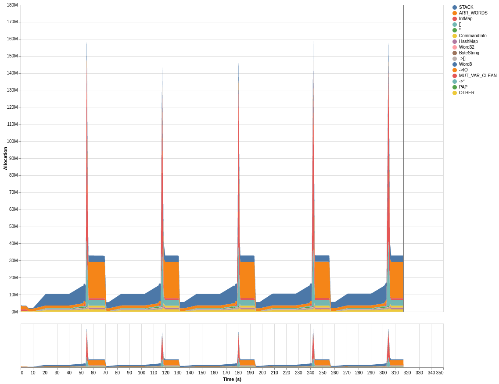

Let's run the gundeck integration tests in full with this new change and see
what happens.


## Current Problems

- Nothing is watching the connection, so if it goes down, it doesn't get
  refreshed until someone wants it
- Any IOException will trigger a reconnect of redis
- If this is due to failing conditions, it might not be able to re-establish a
  connection, which will then block every new thread, worsening conditions.
- Every thread contents to replace the ReConnection.

